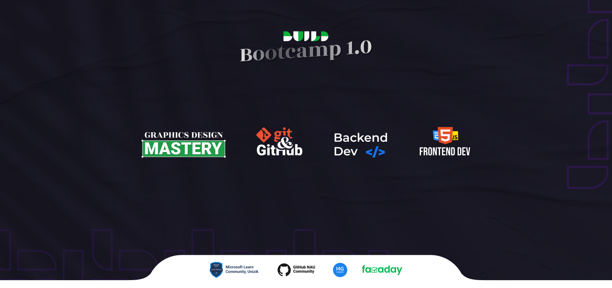

<h1 align="center"> Build 1.0 | Git-and-Github track. </h1>

  

<h3> <b> Welcome to Build 1.0 Bootcamp. </b> This track is for the Git and Github. What better way to learn git and github than to use Git and Github itself?</h3>

<h3>Expand the table of contents below to see the curated learning resources for each week. Content will be updated each week, so check back here to see new learning content added. </h3>

 

<h1 align="center" ><b>Table of Contents<b></h1>

 <h2>Week 1 | Getting familiar</h2> 

**Go to
  [Week 1](./Week_1/0_week1.md)**
  
**Go to your [Week 1 Assessment](https://github.com/mlscunizik/Build-Bootcamp/blob/main/Week_1/7_Understanding_Git_terminlologies.md#week-1-wrap-up)**

 

For a guide on Assessments, click
[here](./assessments.md)

For a guide to submit feedback to us, click
[here](./feedback.md)

